# Documentación del Frontend - Sistema de Gestión Comunitaria

Este documento detalla la estructura y el funcionamiento del frontend de la aplicación, centrándose en la carpeta `src` y sus componentes principales. Las demás carpetas fuera de `src` serán documentadas en fases posteriores del proyecto.

## 1. Visión General de la Carpeta `src`

La carpeta `src` es el corazón de la aplicación, conteniendo todo el código fuente del frontend. Su estructura se basa en componentes reutilizables y una clara separación de responsabilidades para facilitar el desarrollo y mantenimiento.

### 1.1. Flujo Principal de la Aplicación

El flujo de la aplicación se inicia en `main.jsx` y se gestiona a través de `App.jsx`:

* **`main.jsx`**: Este archivo es el punto de entrada principal de la aplicación. Se encarga de la configuración inicial, incluyendo el modo estricto de React (`React.StrictMode`), la configuración de rutas (`BrowserRouter` de `react-router-dom`) y el montaje del componente principal `App`.

* **`App.jsx`**: Aquí se definen todas las rutas de la aplicación. La arquitectura del programa se organiza en cinco tipos de menús principales:

  * **Cuatro módulos específicos**: Panteón, Pagos de Agua, Delegación y Módulo de Personas.

  * **Panel de Control del Administrador**: Destinado al delegado.

Aunque la gestión de usuarios aún está en desarrollo, la creación de los módulos ha comenzado. La meta es que todos los módulos de gestión (Panteón, Pagos de Agua, Personas) cuenten con las siguientes funcionalidades principales:

* **CRUD Básico (Lectura, Creación, Edición)**: Se prioriza la lectura, creación y edición de registros.

* **Desactivación de Registros**: La acción de eliminar registros no está permitida; en su lugar, se implementará una funcionalidad para desactivar registros.

* **Generación de Informes**: Todos los módulos incluirán la opción de generar informes con información relevante para la interfaz. La funcionalidad de impresión y generación de tickets está planificada para fases futuras.

La prioridad actual es completar las funcionalidades CRUD y la generación de informes. Una vez resuelto esto, se procederá con la implementación de la gestión de usuarios y, finalmente, los detalles de impresión y tickets para cada módulo.

### 1.2. Optimización y Reutilización de Componentes

Para simplificar el desarrollo y evitar la duplicación de código, se han adoptado las siguientes estrategias:

* **Plantilla Principal para Submenús**: Los módulos que no son el panel del delegado (Panteón, Pagos de Agua, Delegación, Personas) utilizan una plantilla principal reutilizable. Esta plantilla se adapta dinámicamente según el módulo seleccionado, lo que evita la necesidad de crear cuatro plantillas idénticas y reduce la complejidad del código.

* **Reutilización de Componentes (Plan Futuro)**: Se busca aplicar un enfoque similar a los componentes dentro de cada módulo. Dada la posibilidad de tener 4 módulos con 4 funcionalidades (lectura, creación, edición, informes), se podrían generar hasta 16 plantillas si no se optimiza. La estrategia es crear componentes comunes que compartan la mayor parte de la lógica y la interfaz, y solo las partes diferenciadoras se implementen de forma específica para cada funcionalidad o módulo. Se evalúa la posibilidad de reducir aún más el número de plantillas generales.

### 1.3. Detalles Técnicos y Librerías

La aplicación se basa en una plantilla preexistente, lo que le confiere características como:

* **Modo Oscuro/Claro**: Soporte para alternar entre temas visuales.

* **Diseño Responsivo**: La interfaz es adaptable a diferentes tamaños de pantalla (escritorio, tablet, móvil), garantizando la accesibilidad.

* **Validación de Datos**: Se utiliza la librería `yup` en conjunto con `react-hook-form` (asumido por el uso de `yup` con React) para la validación de entrada de datos en formularios, asegurando la integridad de la información.

* **Funciones de Utilidad**: Se han creado dos funciones para agregar automáticamente la hora a los registros cuando es necesario, simplificando la entrada de datos por parte del usuario.

## 2. Conexiones con el Backend

Todas las conexiones con el backend se gestionan en la carpeta `api`. Aquí se encuentran los archivos de conexión principales, como `api_user.js` y `api_account.js`. Se utiliza la librería `axios` para facilitar el trabajo con las peticiones HTTP, aprovechando su simplicidad y robustez.

## 3. Estilos (CSS) e Imágenes

* **CSS**: Se utiliza el CSS proporcionado por la plantilla base. No se han creado ni modificado estilos personalizados hasta el momento.

* **Imágenes**: Las imágenes utilizadas son las que vienen por defecto con la plantilla. Se han utilizado muy pocas y se espera que sean eliminadas o reemplazadas por activos finales una vez que el proyecto esté terminado.

## 4. Organización de Carpetas Detallada

A continuación, se describe la función de cada carpeta principal dentro de `src`:

* **`pages`**: Contiene todas las páginas principales que se renderizan en la aplicación. Cada página utiliza su respectiva barra lateral y un encabezado común. Actualmente, se está evaluando si cada módulo tendrá sus propias páginas específicas o si se mantendrá una plantilla reutilizable para todos. Incluye páginas como el menú de inicio, plantillas para el panel del delegado y la página de inicio de sesión.

* **`partials`**: Este directorio aloja un tipo específico de componentes, siguiendo la estructura de la plantilla. Los componentes principales aquí son la barra lateral (`Sidebar`) y el encabezado (`Header`). La barra lateral es funcional y gestiona correctamente los submenús, aunque su organización interna aún está en proceso de optimización. El encabezado no tiene funcionalidad implementada por el momento, pero no es una prioridad actual.

* **`utils`**: Contiene funciones de utilidad que son compartidas a lo largo de la aplicación. Aquí se encuentran las funciones para agregar fechas automáticamente, la lógica para el color del tema (modo oscuro/claro), transiciones y otro código JavaScript de propósito general.

## 5. Diagrama de Organización de Carpetas

A continuación, se presenta un diagrama que ilustra la estructura de las carpetas dentro de `src` y sus relaciones.

```mermaid
%%{init: {'theme': 'base', 'themeVariables': { 'primaryBorderColor': '#666' }}}%%
flowchart TD
    src["src/"] --> api["api/ (Conexiones con el backend usando Axios)"]
    src --> charts["charts/ (Componentes o lógica para gráficos)"]
    src --> components["components/ (Componentes reutilizables generales)"]
    components --> comp_customers["customers/ (Componentes para gestión de clientes)"]
    components --> modules["modules/ (Componentes por módulo)"]
    components --> ui["ui/ (Componentes de UI atómicos)"]
    src --> css["css/ (Archivos de estilos)"]
    css --> additional_styles["additional-styles/ (Estilos personalizados)"]
    src --> images["images/ (Activos de imágenes)"]
    src --> lib["lib/ (Librerías externas)"]
    src --> pages["pages/ (Páginas principales)"]
    pages --> panteon["panteon/ (Módulo Panteón)"]
    pages --> personas["personas/ (Módulo Personas)"]
    src --> partials["partials/ (Componentes parciales)"]
    partials --> analytics["analytics/ (Lógica de analíticas)"]
    partials --> partials_customers["customers/ (Componentes clientes)"]
    partials --> job["job/ (Componentes de trabajos)"]
    src --> utils["utils/ (Funciones utilitarias)"]

    classDef folder fill:#e1f5fe,stroke:#039be5,stroke-width:2px;
    classDef subfolder fill:#b3e5fc,stroke:#0288d1,stroke-width:2px;
    
    class api,charts,components,css,images,lib,pages,partials,utils folder
    class comp_customers,modules,ui,additional_styles,panteon,personas,analytics,partials_customers,job subfolder
```

Propmt generico para consulta con ia

me ayudas a hacer el siguiente cambio en mi barra lateral, <objetivo>Cambiar una parte de esta, y que toda la parte donde actualmente dice persona sea dinamica</objetivo> <como lo haremos></como lo haremos> <interfaz></interfaz>
